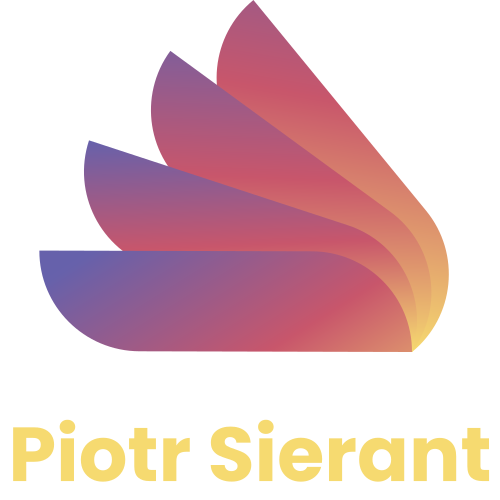

###

<div align="center">
  <a href="https://github.com/othneildrew/Best-README-Template">
    
  </a>

<h3 align="center">IG Exercise frontend</h3>

Project Link: [https://github.com/PiotrSierant/IG_exercise.frontend](https://github.com/PiotrSierant/IG_exercise.frontend)

  <p align="center">
    <a href="https://piotrsierant.github.io/IG_exercise.frontend/">View Live</a>
  </p>
</div>

## ABOUT THE EXERCISE


### Built With

 
 
 
 


<!-- GETTING STARTED -->

## Getting Started

This is an example of how you may give instructions on setting up your project locally.
To get a local copy up and running follow these simple example steps.

### Installation

1. Clone the repo
   ```sh
   git clone https://github.com/PiotrSierant/IG_exercise.frontend.git
   ```
2. Install NPM packages
   ```sh
   npm install
   ```
3. Start project
   ```sh
   npm start
   ```
